# Workshop - Lab 02

In this lab exercise you are going to start using GitHub as a remote hosting solution for your repository and take the first steps towards performing collaborative workflows on GitHub.

You will need to use your own GitHub account so be sure to have your credentials handy!

## Task 1

This task creates a repository on GitHub and starts using it as a remote for the `vlan-config` repo you worked on in the previous lab.

### Step 1

Open your web browser and login to [GitHub](https://github.com/). On the homepage, you should be able to find a button that creates a new repository. If your account is completely new (has no repositories), the page will look a bit different than if you had already done some work on GitHub. The screenshots included below show both variants.

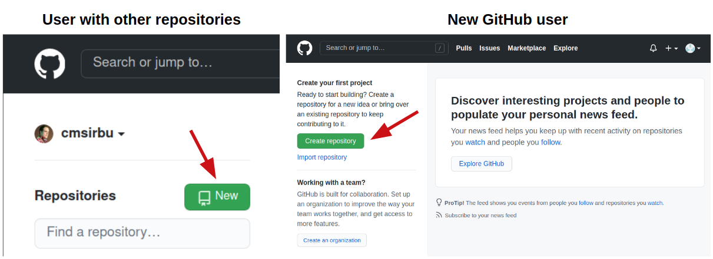


### Step 2

Create a new repository on GitHub. Call it `vlan-config`, but keep in mind it does NOT have to match with your local folder name. It's good to have the same names for consistency and findability though.

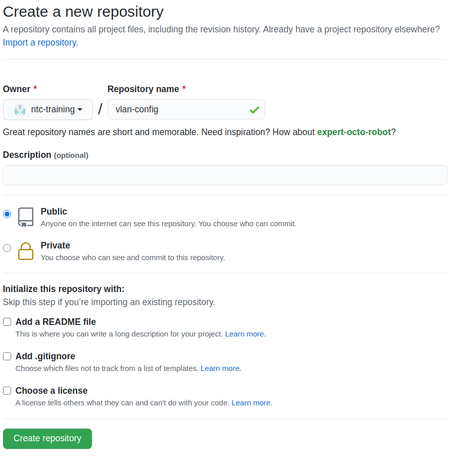

### Step 3

The repository page should look like this. It is completely empty by choice as you will be pushing from your already populated local repository.

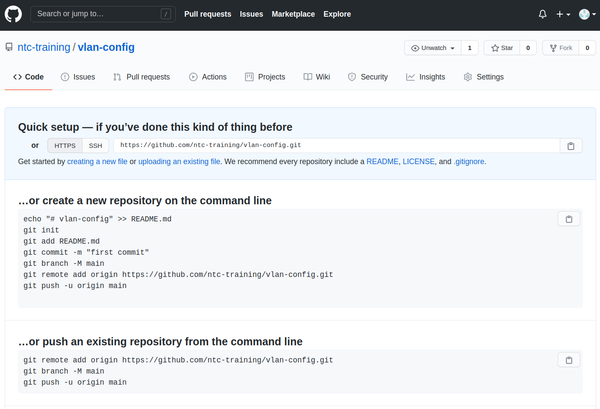

> Note: GitHub even helpfully provides the commands you would need to execute to do just this, but you will go through this step by step.

### Step 4

Open an SSH session to the lab machine where your local repository from the previous lab is located.

Change into the `/home/ntc/labs/vlan-config` folder and confirm the structure looks like the output below.

```
ntc training ~ $ cd /home/ntc/labs/vlan-config

ntc training ~/labs/vlan-config (master) $ tree
.
├── group_vars
│   └── all.yml
├── inventory
├── output
│   ├── dub-router-01_vlans.cfg
│   ├── dub-router-02_vlans.cfg
│   ├── dub-router-03_vlans.cfg
│   ├── dub-router-04_vlans.cfg
│   ├── dub-router-05_vlans.cfg
│   ├── nyc-router-01_vlans.cfg
│   ├── nyc-router-02_vlans.cfg
│   ├── nyc-router-03_vlans.cfg
│   ├── nyc-router-04_vlans.cfg
│   └── nyc-router-05_vlans.cfg
├── pb_vlans.yml
└── templates
    └── vlans.j2

3 directories, 14 files
```

### Step 5

Type `git remote` to confirm there is no remote defined yet for the repository. There is no output.

```
ntc training ~/labs/vlan-config (master) $ git remote
ntc training ~/labs/vlan-config (master) $
```

### Step 6

Copy the repository URL from the GitHub page.

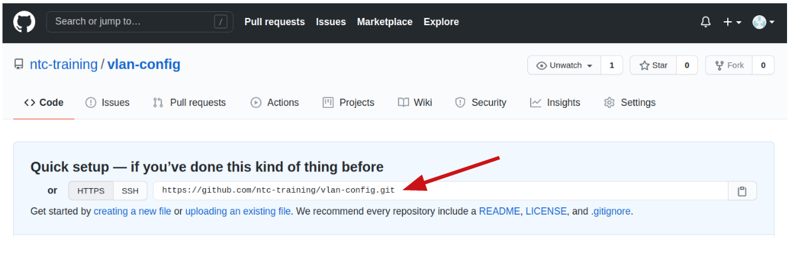

After, add your newly created GitHub repository as the `origin` remote.

`!!!` Remember to replace the URL with your own repository URL. What should change is that your own GitHub username replaces `ntc-training`. `!!!`

```
ntc training ~/labs/vlan-config (master) $ git remote add origin https://github.com/ntc-training/vlan-config.git

ntc training ~/labs/vlan-config (master) $ git remote -v
origin  https://github.com/ntc-training/vlan-config.git (fetch)
origin  https://github.com/ntc-training/vlan-config.git (push)
```

### Step 7

Nothing has happened yet. You may refresh your GitHub repository page if you wish, it should still be empty.

Push your local repository to GitHub. Since this is a `write` operation, GitHub will require you to log in - this is done transparently by the `git` command line client.

```
ntc training ~/labs/vlan-config (master) $ git push origin master
Username for 'https://github.com': ntc-training
Password for 'https://ntc-training@github.com':
Enumerating objects: 18, done.
Counting objects: 100% (18/18), done.
Delta compression using up to 2 threads
Compressing objects: 100% (12/12), done.
Writing objects: 100% (18/18), 1.63 KiB | 832.00 KiB/s, done.
Total 18 (delta 3), reused 0 (delta 0)
remote: Resolving deltas: 100% (3/3), done.
To https://github.com/ntc-training/vlan-config.git
 * [new branch]      master -> master
```

> Note: you may use either HTTPS or SSH as transport for git and both require authentication. It is fairly common to set up SSH authentication using public keys to make it less cumbersome than having to write the username and password every time.

### Step 8

Refresh your GitHub webpage for the repository - you will notice that the two are now in sync.

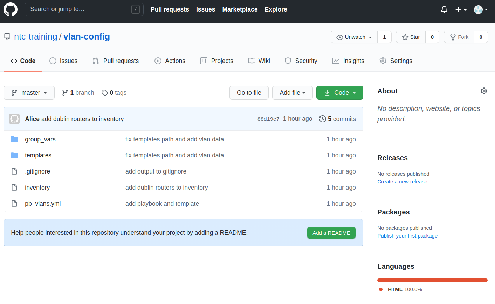

> Note: every time you work on your repository you will have to sync (pushing, pulling, merging) the two, nothing happens automatically!


## Task 2

As you are set up now with a GitHub remote, it's time to add another file and prepare for other collaborative workflows.

### Step 1

On your lab machine repository, create a new file called `README.md` in the root of the `vlan-config` repository.

```
ntc training ~/labs/vlan-config (master %) $ cat README.md
# Vlan Configuration Playbook

An Ansible playbook that generates configuration files from VLAN data.

ntc training ~/labs/vlan-config (master %) $
```

### Step 2

Stage and commit the file.

```
ntc training ~/labs/vlan-config (master %) $ git add README.md

ntc training ~/labs/vlan-config (master +) $ git status
On branch master
Changes to be committed:
  (use "git restore --staged <file>..." to unstage)
        new file:   README.md

ntc training ~/labs/vlan-config (master +) $ git commit -m "add README"
[master fee2f6d] add README
 1 file changed, 4 insertions(+)
 create mode 100644 README.md
```

### Step 3

At this point, the new file is part of the repository, but only locally. Your local repo is now out of sync with the GitHub repo. To finalize, push the local changes upstream.

```
ntc training ~/labs/vlan-config (master) $ git push origin master
Username for 'https://github.com': ntc-training
Password for 'https://ntc-training@github.com':
Enumerating objects: 4, done.
Counting objects: 100% (4/4), done.
Delta compression using up to 2 threads
Compressing objects: 100% (3/3), done.
Writing objects: 100% (3/3), 355 bytes | 355.00 KiB/s, done.
Total 3 (delta 1), reused 0 (delta 0)
remote: Resolving deltas: 100% (1/1), completed with 1 local object.
To https://github.com/ntc-training/vlan-config.git
   88d19c7..fee2f6d  master -> master
```

### Step 4

Refresh your GitHub webpage - you will notice that the README file is now rendered on the repository homepage.

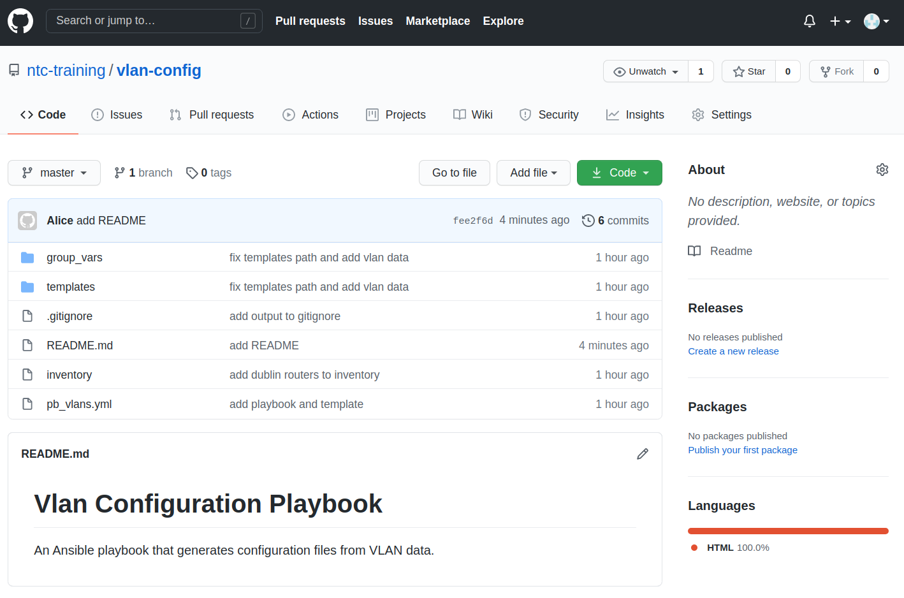

### Step 5

You might remember the `output` folder - which is ignored by git - from the previous lab. It contains the generated configuration files and we have decided it is not going to be stored in the repository. Compare the GitHub repo with the local working directories.

```
ntc training ~/labs/vlan-config (master) $ tree
.
├── README.md
├── group_vars
│   └── all.yml
├── inventory
├── output
│   ├── dub-router-01_vlans.cfg
│   ├── dub-router-02_vlans.cfg
│   ├── dub-router-03_vlans.cfg
│   ├── dub-router-04_vlans.cfg
│   ├── dub-router-05_vlans.cfg
│   ├── nyc-router-01_vlans.cfg
│   ├── nyc-router-02_vlans.cfg
│   ├── nyc-router-03_vlans.cfg
│   ├── nyc-router-04_vlans.cfg
│   └── nyc-router-05_vlans.cfg
├── pb_vlans.yml
└── templates
    └── vlans.j2

3 directories, 15 files
```

### Step 6

Since the GitHub repository is now in sync with the local one, you can safely delete your local copy. Let's pretend we're finished developing for now.

```
ntc training ~/labs/vlan-config (master) $ cd ..
ntc training ~/labs $ rm -rf vlan-config/
ntc training ~/labs $ ls
ntc training ~/labs $
```

### Step 7

Now pretend a few days have passed and you're on another computer. You want to continue development on the `vlan-config` repository, so you decide to fetch a fresh copy from GitHub.

If you don't remember the URL, you can copy it from the GitHub repository homepage.

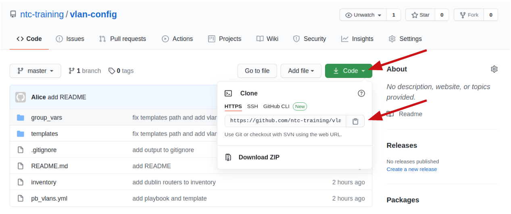

Use the URL to clone the repository locally.

```
ntc training ~/labs $ git clone https://github.com/ntc-training/vlan-config.git
Cloning into 'vlan-config'...
remote: Enumerating objects: 21, done.
remote: Counting objects: 100% (21/21), done.
remote: Compressing objects: 100% (11/11), done.
remote: Total 21 (delta 4), reused 21 (delta 4), pack-reused 0
Unpacking objects: 100% (21/21), 1.90 KiB | 278.00 KiB/s, done.

ntc training ~/labs $ tree
.
└── vlan-config
    ├── README.md
    ├── group_vars
    │   └── all.yml
    ├── inventory
    ├── pb_vlans.yml
    └── templates
        └── vlans.j2

3 directories, 5 files
ntc training ~/labs $
```

### Step 8

Take a closer look at the repository. All the files that are tracked by git are there, together with their full history.

```
ntc training ~/labs/vlan-config (master=) $ git log
commit fee2f6d71edb68409d7e9f39a5944adb5dbf109b (HEAD -> master, origin/master, origin/HEAD)
Author: Alice <alice@example.com>
Date:   Mon Nov 30 14:01:38 2020 +0000

    add README

commit 88d19c7541c840388e89bda4c2f8f53e7264f34b
Author: Alice <alice@example.com>
Date:   Mon Nov 30 12:49:05 2020 +0000

    add dublin routers to inventory

commit ee8d02bdffa1ef001180de3e1f35057f5778619c
Author: Alice <alice@example.com>
Date:   Mon Nov 30 12:43:52 2020 +0000

    add output to gitignore

commit 90a03ce098f266905d6480e815f8906f1be9b82c
Author: Alice <alice@example.com>
Date:   Mon Nov 30 12:41:31 2020 +0000

    fix templates path and add vlan data

commit d89f061822c02865c05642775dbb78e1dc656e2d
Author: Alice <alice@example.com>
Date:   Mon Nov 30 12:38:29 2020 +0000

    add playbook and template

commit b86984dee53c11b14a45d438316bf6ace85a9a94
Author: Alice <alice@example.com>
Date:   Mon Nov 30 12:32:30 2020 +0000

    add inventory file
ntc training ~/labs/vlan-config (master=) $
```


## Task 3

As you are the maintainer of this repository (i.e. you have write access to it, you can make changes) you can always simply push changes to the `master` branch directly. But in a collaborative environment, it's good practice to develop on a separate branch (that's a snapshot in time of the repository) and then merge it back into the master (or main) branch.

You will now make a modification to the inventory and submit it through the GitHub flow - i.e. submit a Pull Request.

### Step 1

Dublin now has 5 new routers, so you need to go into the inventory file and expand the list.

First, create a new branch named `dublin-routers`. Then, switch to it - this new branch is created from `master` and its files are identical.

```
ntc training ~/labs/vlan-config (master=) $ git branch dublin-routers
ntc training ~/labs/vlan-config (master=) $ git branch
  dublin-routers
* master
ntc training ~/labs/vlan-config (master=) $ git checkout dublin-routers
Switched to branch 'dublin-routers'

ntc training ~/labs/vlan-config (dublin-routers) $ tree
.
├── README.md
├── group_vars
│   └── all.yml
├── inventory
├── pb_vlans.yml
└── templates
    └── vlans.j2

2 directories, 5 files
```

> Note: the prompt has changed - it's showing the current active branch. Having such a prompt is extremely useful.
> You could also use a shortcut when creating a new branch - `git checkout -b dublin-routers` which combines two commands (the creation and switch) in one.

### Step 2

Edit the `inventory` file as shown below.

```
ntc training ~/labs/vlan-config (dublin-routers *) $ cat inventory
nyc-router-[01:05]
dub-router-[01:10]

ntc training ~/labs/vlan-config (dublin-routers *) $ git diff
diff --git a/inventory b/inventory
index 3e18a93..c28c34a 100644
--- a/inventory
+++ b/inventory
@@ -1,2 +1,2 @@
 nyc-router-[01:05]
-dub-router-[01:05]
+dub-router-[01:10]
ntc training ~/labs/vlan-config (dublin-routers *) $
```

### Step 3

Stage and commit the changes.

```
ntc training ~/labs/vlan-config (dublin-routers *) $ git add inventory

ntc training ~/labs/vlan-config (dublin-routers +) $ git commit -m "add more dublin routers"

[dublin-routers 0434c22] add more dublin routers
 1 file changed, 1 insertion(+), 1 deletion(-)
ntc training ~/labs/vlan-config (dublin-routers) $
ntc training ~/labs/vlan-config (dublin-routers) $

ntc training ~/labs/vlan-config (dublin-routers) $ git log
commit 0434c22e24c008bdaddb00e9e212517a9022d3c6 (HEAD -> dublin-routers)
Author: Alice <alice@example.com>
Date:   Mon Nov 30 14:53:33 2020 +0000

    add more dublin routers

commit fee2f6d71edb68409d7e9f39a5944adb5dbf109b (origin/master, origin/HEAD, master)
Author: Alice <alice@example.com>
Date:   Mon Nov 30 14:01:38 2020 +0000

    add README
<OUTPUT SNIPPED>
```

Check the `git log` - while the `dublin-routers` branch now has a new commit, you can see that the `master` branch is at its original state (one commit behind).

### Step 4

It's time now to push the changes to GitHub and prepare to merge this change into the master branch. This whole process makes reviewing easier and allows someone else (like a colleague) to review your changes before allowing them into the `master` branch.

```
ntc training ~/labs/vlan-config (dublin-routers) $ git push --set-upstream origin dublin-routers
Username for 'https://github.com': ntc-training
Password for 'https://ntc-training@github.com':
Enumerating objects: 5, done.
Counting objects: 100% (5/5), done.
Delta compression using up to 2 threads
Compressing objects: 100% (2/2), done.
Writing objects: 100% (3/3), 285 bytes | 285.00 KiB/s, done.
Total 3 (delta 1), reused 0 (delta 0)
remote: Resolving deltas: 100% (1/1), completed with 1 local object.
remote:
remote: Create a pull request for 'dublin-routers' on GitHub by visiting:
remote:      https://github.com/ntc-training/vlan-config/pull/new/dublin-routers
remote:
To https://github.com/ntc-training/vlan-config.git
 * [new branch]      dublin-routers -> dublin-routers
Branch 'dublin-routers' set up to track remote branch 'dublin-routers' from 'origin'.
```

> Note: since the `dublin-routers` branch is local only, you need to tell git to create a remote branch as well (on `origin` which in this case is GitHub).

### Step 5

Visit the GitHub repository homepage (you may need to refresh). GitHub has noticed new changes have been pushed to a separate branch and is offering to create a Pull Request for merging the changes into the master branch.

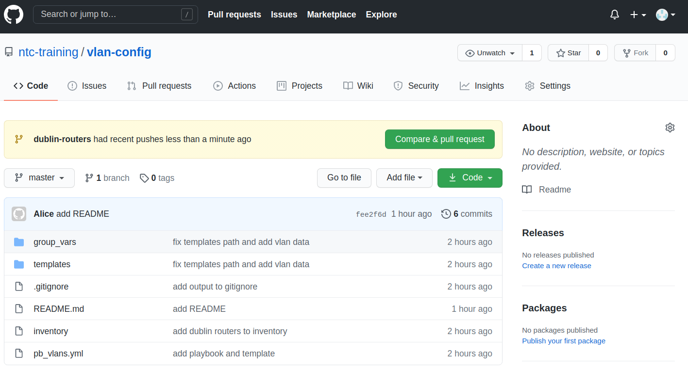

Click the `Compare & pull request` button.

### Step 6

In the new page that has just opened, you can add comments and change the title of the PR (Pull Request), then finally submit it by clicking the green "Create pull request" button.

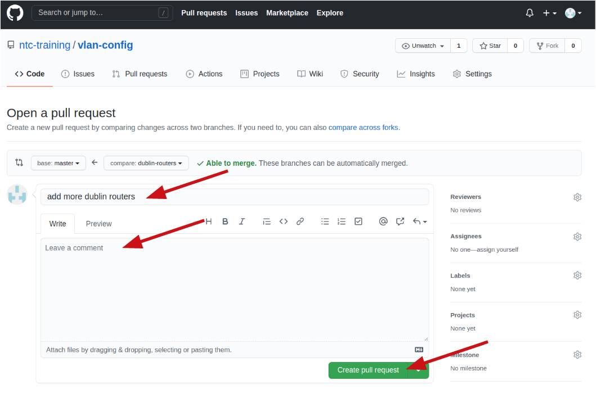

### Step 7

The PR is now created and you can ask someone else to review it by giving them the link - it will looks something like `https://github.com/ntc-training/vlan-config/pull/1`.

Additionally, whoever is reviewing it can review the files that are changed by clicking on the `Files changed` tab.

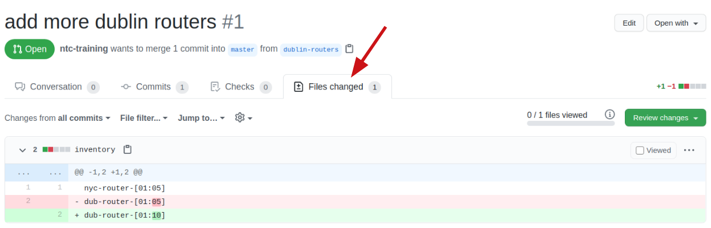

### Step 8

Once you're happy with the PR, you may choose to merge it. The button is at the bottom of the main PR page (the `Conversation` tab if you navigated somewhere else) and has the text `Merge pull request`.

Click it now, then `Confirm merge`.

It'll take a couple seconds and when it's done, GitHub will offer to delete the `dublin-routers` branch. If the branch was created for a single one-shot change, it's good to keep a clean house and delete it.

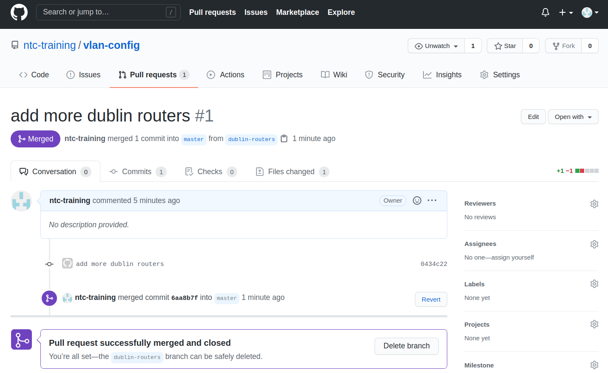

> Note: if you choose to delete the branch, it will only be deleted in the GitHub copy of the repository. Your local one will still have it until you choose to delete the local branch.

### Step 9

View the `inventory` file by opening it in the GitHub web interface and confirm the contents have been updated as per the change (the second line should read `dub-router-[01:10]`).

### Step 10

Back on your lab machine, it's time to synchronize and pull the updated master branch (first switch to it!).

```
ntc training ~/labs/vlan-config (dublin-routers=) $ git branch
* dublin-routers
  master

ntc training ~/labs/vlan-config (dublin-routers=) $ git checkout master
Switched to branch 'master'
Your branch is up to date with 'origin/master'.

ntc training ~/labs/vlan-config (master=) $ git pull origin master
remote: Enumerating objects: 1, done.
remote: Counting objects: 100% (1/1), done.
remote: Total 1 (delta 0), reused 0 (delta 0), pack-reused 0
Unpacking objects: 100% (1/1), 636 bytes | 636.00 KiB/s, done.
From https://github.com/ntc-training/vlan-config
 * branch            master     -> FETCH_HEAD
   fee2f6d..6aa8b7f  master     -> origin/master
Updating fee2f6d..6aa8b7f
Fast-forward
 inventory | 2 +-
 1 file changed, 1 insertion(+), 1 deletion(-)

ntc training ~/labs/vlan-config (master=) $ cat inventory
nyc-router-[01:05]
dub-router-[01:10]
```

> Note: since your repository on GitHub is public, you don't need to authenticate for read operations - anyone can see it anonymously!

### Step 11

You can also delete the local `dublin-routers` branch since you no longer need it.

```
ntc training ~/labs/vlan-config (master=) $ git branch -D dublin-routers
Deleted branch dublin-routers (was 0434c22).
```
