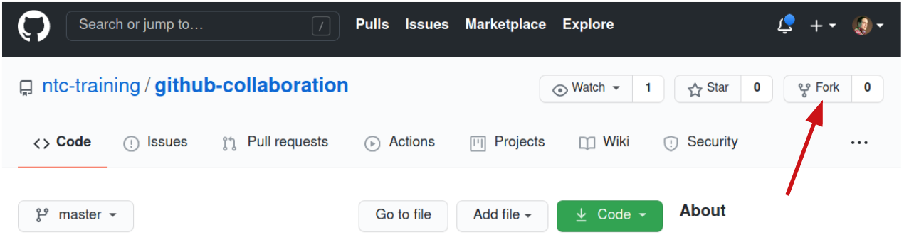
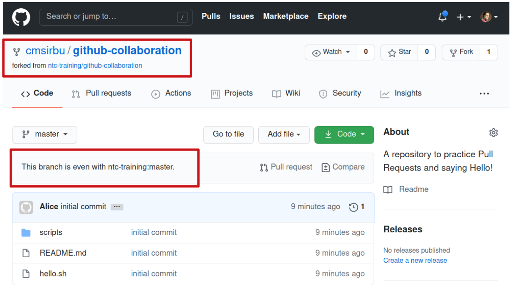
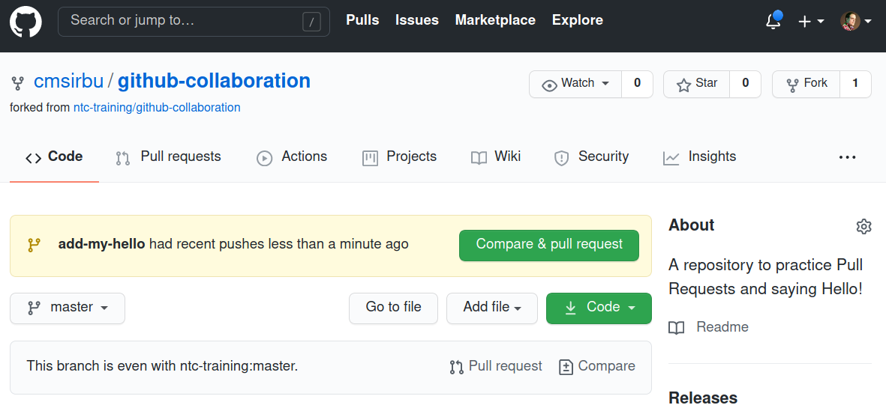
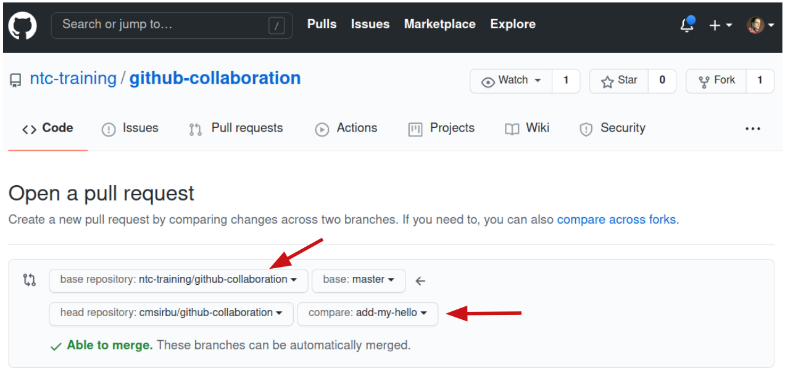

# Workshop - Lab 03

In this lab exercise you will contribute to a GitHub repository that is maintained by someone else. The workflow you will follow is that of creating a fork, making the changes, and submitting a Pull Request upstream.

You will need to use your own GitHub account so be sure to have your credentials handy!

## Task 1

### Step 1

In your web browser navigate to this repository (or open in a new tab): [https://github.com/ntc-training/github-collaboration](https://github.com/ntc-training/github-collaboration)

Look around for a bit - you will see a folder named `scripts` that contains a couple python files. They each just print out a hello message and you will be contributing your very own script here!

### Step 2

Since you do not have access to this repository, you need to submit your changes via a Pull Request. This workflow is specific to GitHub but can be found with slight variations on other similar platforms (like Gitlab, Bitbucket etc.).

Hit the `Fork` button in the top right of the page to create your own fork of this repository under your account. You need to be logged in for this to work!



### Step 3

GitHub will work a bit and then redirect you to your very own fork of the `github-collaboration` repository! It should look like the following screenshot - pay special attention to the top-left which shows where this repository is coming from (its upstream).

Since you have just forked it, your repository is in sync with its upstream - this may very well change in the future, but for now you are up to date!



### Step 4

You should now clone your newly forked repository on your lab machine to start making changes to its files. Get your repository URL from the browser address bar or by clicking the green `Code` drop-down button.

On your lab machine, clone it under the `/home/ntc/labs` directory as shown below.

```
ntc training ~/labs $ git clone https://github.com/YOURNAME/github-collaboration
Cloning into 'github-collaboration'...
remote: Enumerating objects: 7, done.
remote: Counting objects: 100% (7/7), done.
remote: Compressing objects: 100% (5/5), done.
remote: Total 7 (delta 0), reused 7 (delta 0), pack-reused 0
Unpacking objects: 100% (7/7), 614 bytes | 614.00 KiB/s, done.

ntc training ~/labs $ cd github-collaboration/

ntc training ~/labs/github-collaboration (master=) $ ls
README.md  hello.sh  scripts
```

### Step 5

Create a new branch called `add-my-hello` and switch to it. Confirm that it is the active branch (it has an asterisk next to its name).

```
ntc training ~/labs/github-collaboration (master=) $ git checkout -b add-my-hello
Switched to a new branch 'add-my-hello'
ntc training ~/labs/github-collaboration (add-my-hello) $ git branch
* add-my-hello
  master
```

### Step 6

Change to the scripts directory and create a new file. Name this file after your lab pod number (XX) and your first name, then customize its message inside.

> Note: if your lab machine is named `training-06` then your pod number is 06.

```
ntc training ~/labs/github-collaboration (add-my-hello) $ cd scripts/

ntc training ~/labs/github-collaboration/scripts (add-my-hello) $ cat XX_from_FirstName.py
print("Hello From FirstName!")
```

> Note: If you want to customize the message, feel free to write it in your own language, but at the very least say hello :)

### Step 7

Stage and commit the file, then push to your repository. This is identical to the flow of the previous lab, since you own the forked repository.

Remember to replace the files and names with your own variants!

```
ntc training ~/labs/github-collaboration/scripts (add-my-hello %) $ git add XX_from_FirstName.py

ntc training ~/labs/github-collaboration/scripts (add-my-hello +) $ git commit -m "Add FirstName's hello script"
[add-my-hello 5bbcf1a] Add Jane's hello script
 1 file changed, 1 insertion(+)
 create mode 100644 scripts/XX_from_FIRSTNAME.py

ntc training ~/labs/github-collaboration/scripts (add-my-hello) $ git push --set-upstream origin add-my-hello
Enumerating objects: 6, done.
Counting objects: 100% (6/6), done.
Delta compression using up to 8 threads
Compressing objects: 100% (3/3), done.
Writing objects: 100% (4/4), 405 bytes | 405.00 KiB/s, done.
Total 4 (delta 1), reused 0 (delta 0)
remote: Resolving deltas: 100% (1/1), completed with 1 local object.
remote:
remote: Create a pull request for 'add-my-hello' on GitHub by visiting:
remote:      https://github.com/YOURNAME/github-collaboration/pull/new/add-my-hello
remote:
To github.com:YOURNAME/github-collaboration.git
 * [new branch]      add-my-hello -> add-my-hello
Branch 'add-my-hello' set up to track remote branch 'add-my-hello' from 'origin'.
```

### Step 8

Visit the GitHub repository homepage (you may need to refresh). GitHub has noticed new changes have been pushed to a separate branch and is offering to create a Pull Request for merging the changes into the master branch.



Click the "Compare & pull request" button.

### Step 9

Since this is a forked repository, the Pull Request (PR) will be created for the upstream repository instead. Pay special attention to the branches GitHub has automatically selected for you.

The source is your local branch `add-my-hello` but the destination is `ntc-training/github-collaboration` branch `master`.



Finalize the process by clicking the "Create pull request" button at the bottom right of the screen.

### Step 10

Observe the page you have now been sent to. The Pull Request is created on the upstream repository and your browser is showing you a URL similar to this: `https://github.com/ntc-training/github-collaboration/pull/1`.

The only difference you should see is the number at the end, which is the number of your PR.

Also take note that since this is not your repository, you are not able to merge this PR as you have previously done. You have to wait for the owner of the repository to review and approve your PR!

Please let your instructor know you have submitted a PR!

### Step 11

The instructor will review your PR, and, if your changes are correct, will merge your file into the main (upstream) repository.

Once they tell you it's done, you can refresh the PR page and it should show `Merged`. Alternatively, if they notice any mistakes, they might ask you to make modifications - and help you do it!

You can now navigate in the upstream repository to the scripts folder (hint: `https://github.com/ntc-training/github-collaboration/tree/master/scripts`) and admire the file you have contributed!
